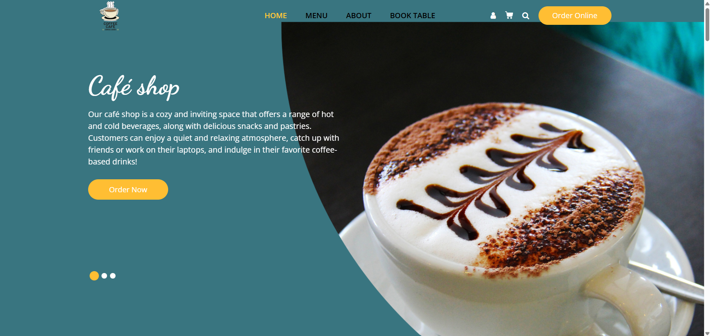
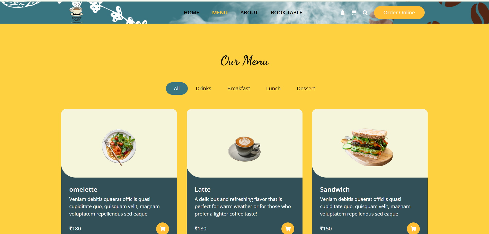
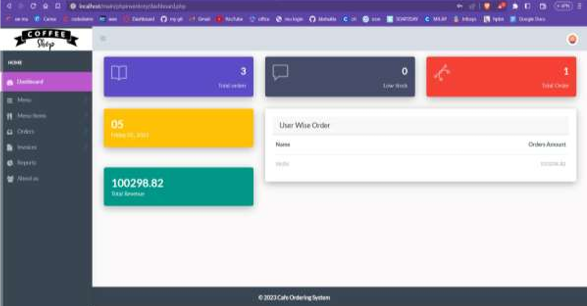

# Café Shop Management System
Database-backed café management website with menu browsing, category filters, online ordering, table reservations, and an administrative dashboard.

## Technologies

- HTML5
- CSS3
- JavaScript
- PHP
- MySQL
- phpMyAdmin for database inspection and administration

## Customer Features

- Café landing page
- Deals of the day
- Menu with category filters
- Menu cards with item information and prices
- Online table-reservation form
- Online order form
- Order-details confirmation page
- Customer testimonials
- About and contact information
- Database storage for submitted reservations and orders

## Administrator Features

- Administrator login
- Dashboard with operational summaries
- Add and manage categories
- View and manage menu items
- View order records
- View table-reservation records
- View café information from the admin panel

## User Flow

### Customer

1. Visit the café home page.
2. Review deals or browse the menu.
3. Filter the menu by category.
4. Submit an online order or table reservation.
5. Review the submitted order details.

### Administrator

1. Sign in through the administrator login page.
2. Open the dashboard.
3. Add or update categories and menu records.
4. Review customer orders and reservations.
5. Maintain the content shown on the customer-facing website.

## Development Process

1. Divided the system into customer-facing and administrator workflows.
2. Designed the café home, menu, About, reservation, and ordering pages.
3. Organized menu items into filterable categories.
4. Connected order and reservation forms to database storage.
5. Created an administrator login and dashboard.
6. Added management screens for categories, menu items, orders, and reservations.
7. Verified submitted values by reviewing the corresponding database records.

## Running the Project

### Requirements

- A local web-server environment with PHP and MySQL
- A browser
- phpMyAdmin or another MySQL client

### Setup

1. Clone the repository into the document-root folder of your PHP web server.
2. Inspect `cafe.sql`, `query_data_insertion.sql`, and `store1.sql` to determine which dumps create the customer and administrator databases and whether they must be imported in a specific order.
3. Create the required MySQL database or databases and import the confirmed SQL dumps.
4. Locate the PHP database-connection settings and update the host, username, password, and database name for your local environment.
5. Start the PHP web server and MySQL.
6. Open the customer entry page and administrator entry page through their server URLs.

## What I Learned

- How to design customer and administrator workflows for the same system
- How to organize menu data using categories
- How to store online orders and table reservations in a database
- How to design forms, confirmation pages, and management screens
- How to create an administrator dashboard for business records
- How customer-facing actions connect to back-office data management

## Possible Improvements

- Add secure password hashing and session management
- Use role-based authorization for administrative actions
- Add server-side validation and prepared database statements
- Add order status tracking and customer order history
- Add reservation availability and conflict checking
- Add inventory and out-of-stock controls

## Screenshots

---

---

---
## Contributors

- Mansiba Gohil
